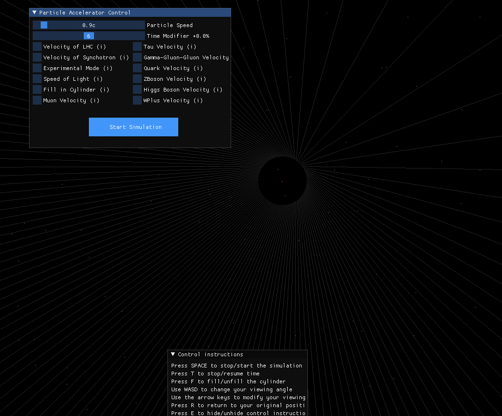
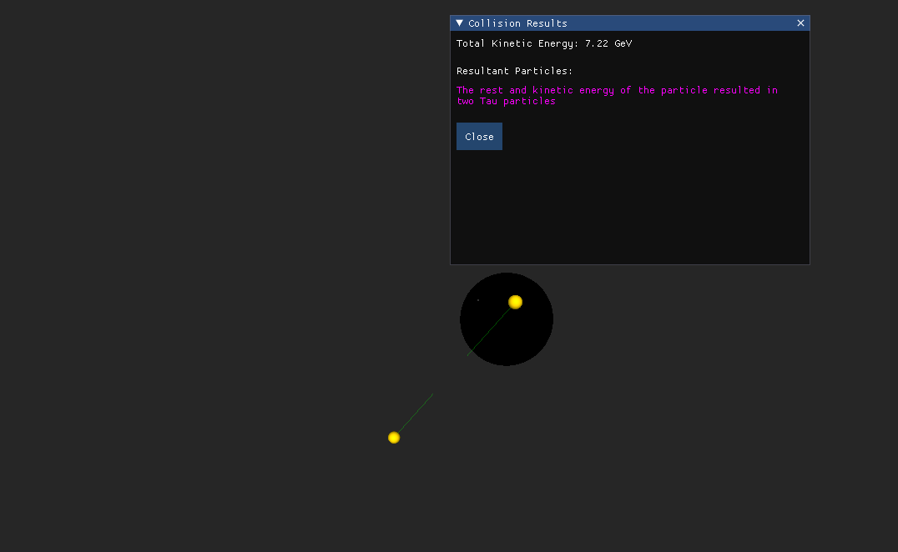
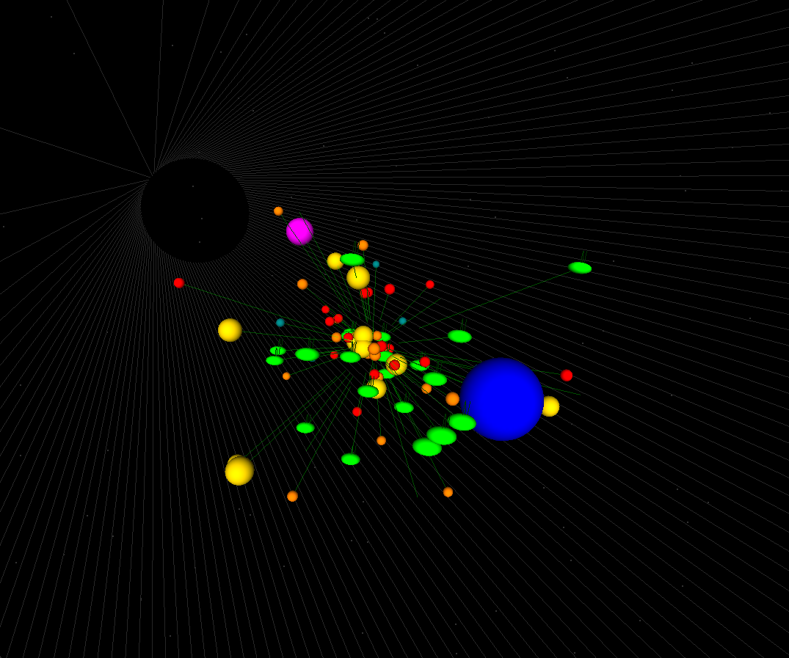

# Particle Accelerator Simulation
## Overview 
This project is a 3D simulation of a particle accelerator that allows users to explore the interaction of electrons and positrons colliding at relativistic speeds. 


## Key Features

- **3D simulation**: The project uses OpenGL to efficiently render dynamic 3D objects within Python, creating visually appealing interactions.
- **Physically accurate**: The simulation is built upon research on electron and positron collisions, ensuring that the particle interactions and resulting particles are scientifically accurate.
- **Simulation of real-world accelerators**: The project includes simulations of velocities achieved by renowned particle accelerators, such as the Large Hadron Collider (LHC) and the early CERN Synchrotron.

## Modes
The project provides 3 separate stages for the user:
1. **The control panel** that allows for modification of the parameters of the simulation. The project provides preset velocities to simulate LHC, the early Synchotron, and the velocities required to create the fundamental particles.
   
2.  **Educational** mode that describes the kinetic energy of the input particles and the resultant particles. This is designed to be useful in a setting where you're attempting to convey the exponential growth of kinetic energy of particles at close to relativistic speeds.
3. The simulation also provides an **Experimental** mode that provides for visually appealing particle interactions and behaviors. This is more for casual use and lets the user explore moving around in a 3 dimensional environment in a fun way. 


## Practical requirements
- Python 3.x
- If you get issues running the run.bat you're going to install C++ tools for windows (Shouldn't be necessary).
  
## Installation and Setup

1. Clone the repository to your local machine using the command ```git clone https://github.com/DiarmuidMalanaphy/Particle-Accelerator-Simulator/```.
2. Ensure you have Python installed.
    
If on windows

1. Click the .bat file and it should automatically run.

If on Linux or Mac

   Unfortunately due to a later discovered bug in Imgui, the application will not work on Linux or MacOs.

## Contributing

Contributions are welcome! If you find any issues or have suggestions for improvements, please open an issue or submit a pull request.


